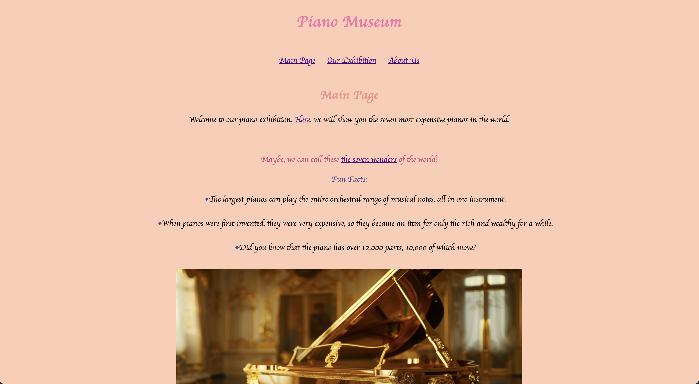
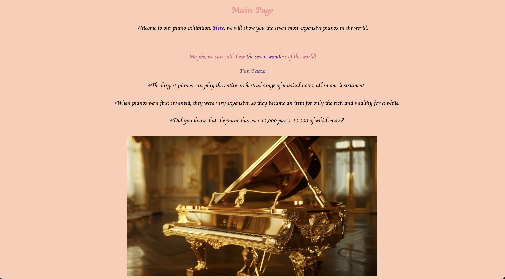
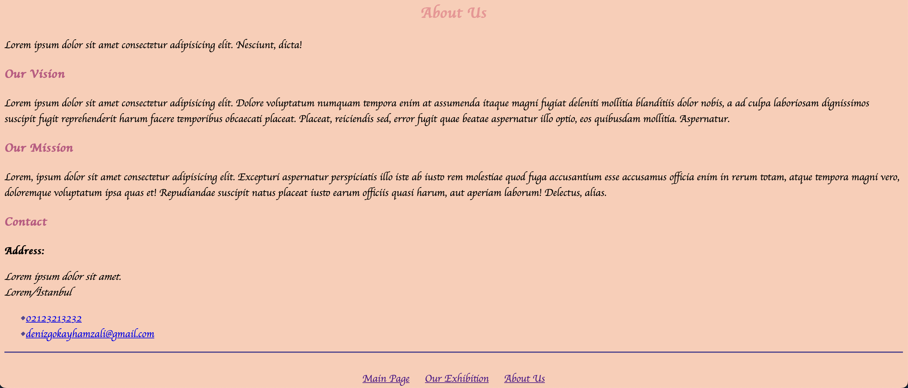

# Piano Museum Website Project
The seven most expensive pianos in the world.

## About The Project

This project has been prepared for Patika.Dev Front-End course.

### Built With
- [HTML](https://en.wikipedia.org/wiki/HTML)
- [CSS](https://en.wikipedia.org/wiki/CSS)

## Getting Started

### Installation 
Clone the repo.

git clone https://github.com/DenizGokayHamzali/PianoMuseum.git

## License
[MIT](choosealicense.com/licenses/mit/) 
 

The copyrights of all the images I have used belong to their owners. 
 
I do not make any profit from these images, thank you.

## Contact

Deniz Gökay Hamzalı 

<denizgokayhamzali@gmail.com>
